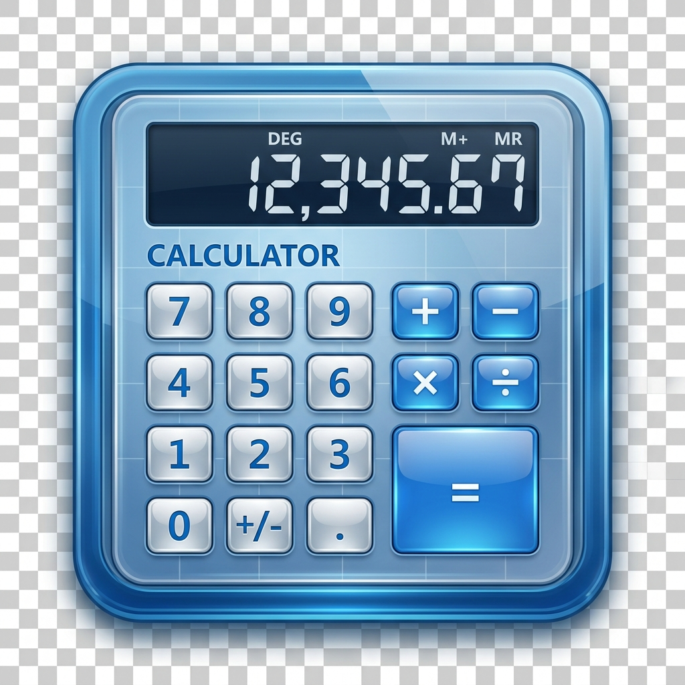
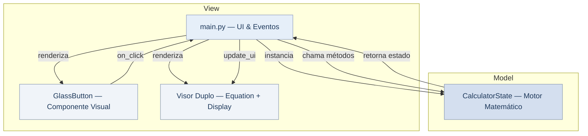

<p align="center">
  
</p>

<h1 align="center">Classic Calculator — Windows 7 Aero Glass</h1>

<p align="center">
  <strong>Réplica fiel da Calculadora do Windows 7 construída com Python + Flet</strong><br/>
  Efeito visual Aero Glass · Fontes originais · Android
</p>

<p align="center">
  <a href="https://www.python.org/downloads/"></a>&nbsp;
  <a href="https://flet.dev/"></a>&nbsp;
  &nbsp;
  &nbsp;
  <a href="https://github.com/caiquenovaes1994/ClassicCalculator_mobile"></a>
</p>

---

## 📖 Sobre o Projeto

Este projeto é uma **réplica pixel-perfect** da Calculadora clássica do Windows 7, reconstruída do zero para rodar nativamente em **Android**.

O objetivo é preservar a estética **Aero Glass** — com seus gradientes azul-acinzentados, bordas sutis e fontes originais (`Segoe UI` e `Consolas`) — enquanto moderniza a base de código com uma arquitetura limpa e modular baseada no padrão MVC.

### Destaques

| Característica | Descrição |
| :--- | :--- |
| 🎨 **Aero Glass Fidelity** | Gradientes, bordas e sombras fiéis ao tema original do Windows 7 |
| 📱 **Mobile-First** | Layout otimizado para dispositivos Android com suporte a notch |
| 📳 **Haptic Feedback** | Vibração tátil em cada pressionamento de botão |
| 🧮 **Visor Duplo** | Exibe a equação em andamento e o resultado simultaneamente |
| 🌎 **Formatação BR** | Números exibidos no padrão brasileiro (`1.234,56`) |
| 🧠 **Memória Completa** | `MC` · `MR` · `MS` · `M+` · `M-` com indicador visual |

---

## ✨ Preview

```text
┌─────────────────────────────────┐
│                           Sobre │  ← Top bar
├─────────────────────────────────┤
│                             12+ │  ← Equation Preview
│                        1.234,56 │  ← Display (Consolas)
├────┬────┬────┬────┬─────────────┤
│ MC │ MR │ MS │ M+ │ M-          │
├────┼────┼────┼────┼─────────────┤
│  ← │ CE │  C │  ± │  √          │
├────┼────┼────┼────┼─────────────┤
│  7 │  8 │  9 │  / │  %          │
├────┼────┼────┼────┼─────────────┤
│  4 │  5 │  6 │  * │  1/x        │
├────┼────┼────┼────┤             │
│  1 │  2 │  3 │  - │    =        │
├─────────┼────┼────┤             │
│    0    │  , │  + │             │
└─────────┴────┴────┴─────────────┘
```

---

## ✅ Funcionalidades

### 🔢 Operações Matemáticas

| Operação | Botão | Teclado |
| :--- | :---: | :---: |
| Adição | `+` | `+` |
| Subtração | `-` | `-` |
| Multiplicação | `*` | `*` |
| Divisão | `/` | `/` |
| Igualdade | `=` | `Enter` |
| Porcentagem | `%` | `%` |
| Raiz Quadrada | `√` | — |
| Inverso (1/x) | `1/x` | — |
| Inversão de Sinal | `±` | — |
| Separador Decimal | `,` | `,` ou `.` |

### 🧠 Gerenciamento de Memória

| Função | Descrição |
| :---: | :--- |
| `MC` | Limpa o valor salvo na memória |
| `MR` | Recupera o valor da memória para o display |
| `MS` | Salva o valor atual do display na memória |
| `M+` | Adiciona o valor atual ao valor salvo |
| `M-` | Subtrai o valor atual do valor salvo |
| **Indicador `M`** | Exibido no display quando a memória está em uso |

### ⌨️ Controles de Tela

| Botão | Teclado | Descrição |
| :---: | :---: | :--- |
| `←` | `Backspace` | Apaga o último dígito |
| `CE` | — | Limpa apenas a entrada atual |
| `C` | `Esc` / `Delete` | Limpa tudo e reinicia a calculadora |

### 🖥️ Interface e Experiência

- **Visor Duplo** — Equação em andamento (ex: `12 +`) na linha superior, valor atual na linha inferior.
- **Haptic Feedback** — Vibração tátil em dispositivos móveis, simulando o clique físico de botões reais.
- **Diálogo Sobre** — Popup com informações do desenvolvedor e link de contato via e-mail.

---

## 🏗️ Arquitetura

O projeto segue uma arquitetura **MVC simplificada**, garantindo separação clara de responsabilidades:



| Camada | Arquivo | Responsabilidade |
| :---: | :--- | :--- |
| **Model** | `calculator_logic.py` | Toda lógica matemática, formatação brasileira, gerenciamento de memória e preview de equação |
| **View** | `main.py` | Componentes visuais (`GlassButton`, Visor Duplo), gradientes Aero Glass e layout |
| **Controller** | `main.py` | Orquestração de eventos `on_click`, haptic feedback e atualização da UI |

---

## 📁 Estrutura do Projeto

```text
ClassicCalculator_mobile/
├── assets/
│   ├── icon.png                  # Ícone da aplicação
│   └── fonts/
│       ├── SegoeUI.ttf           # Fonte dos botões e menus
│       └── consola.ttf           # Fonte monoespaçada do display
├── calculator_logic.py           # Motor matemático (CalculatorState)
├── main.py                       # Ponto de entrada e interface de usuário
├── requirements.txt              # Dependências do projeto
└── README.md                     # Documentação
```

---

## 🛠️ Stack Tecnológica

| Tecnologia | Versão | Função |
| :--- | :---: | :--- |
| [**Python**](https://www.python.org/) | `3.12+` | Linguagem principal |
| [**Flet**](https://flet.dev/) | `0.84+` | Framework UI multiplataforma (Flutter) |
| **Segoe UI** | — | Tipografia de botões, menus e diálogos |
| **Consolas** | — | Tipografia monoespaçada do display numérico |

---

## 📱 Build para Android (APK)

Para gerar o pacote `.apk` para dispositivos Android, utilize o **Flet CLI**:

```bash
flet build apk \
  --project "Calculadora Win7" \
  --org com.caiquenovaes.calc \
  --product "Calculadora Aero7"
```

> **Nota:** Certifique-se de ter o [Android SDK](https://developer.android.com/studio) e as dependências do Flet build configuradas corretamente.

---

## ⌨️ Atalhos de Teclado

| Tecla | Ação |
| :---: | :--- |
| `0` – `9` | Inserir dígito |
| `+` `-` `*` `/` | Operador matemático |
| `Enter` | Calcular resultado |
| `Backspace` | Apagar último dígito |
| `Esc` / `Delete` | Limpar tudo |
| `,` ou `.` | Separador decimal |
| `%` | Calcular porcentagem |

---

## 📋 Histórico de Versões

Consulte o arquivo [CHANGELOG.md](./CHANGELOG.md) para o histórico completo de alterações por versão.

| Versão | Data | Descrição |
| :---: | :---: | :--- |
| [**1.0.0**](./CHANGELOG.md#100--2026-05-12) | 2026-05-12 | Lançamento inicial — Interface Aero Glass, motor matemático completo, suporte a Android |

---

## 📄 Licença

Este projeto é de uso **pessoal e educacional**.  
Distribuição comercial não autorizada sem consentimento prévio do autor.

---

## 👨‍💻 Autor

**Caique Novaes**

[](https://github.com/caiquenovaes1994)
[](mailto:caiquenovaes1994@gmail.com)

---

<p align="center">
  Feito com 🐍 <strong>Python</strong> + ⚡ <strong>Flet</strong><br/>
  <sub>Inspirado no Windows 7 Aero Glass — © 2026</sub>
</p>
