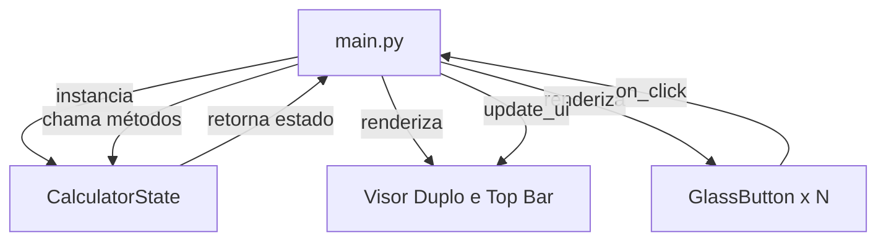

# 🖩 Classic Calculator — Windows 7 Aero Glass Clone

> Uma réplica fiel da Calculadora do **Windows 7** construída com **Python + Flet**, com efeito visual **Aero Glass**, fontes originais e funcionalidade completa.

---

## ✨ Demonstração

```text
┌─────────────────────────────────┐
│                           Sobre │  ← Top bar
├─────────────────────────────────┤
│                             12+ │  ← Equation Preview
│                        1.234,56 │  ← Display Consolas
├────┬────┬────┬────┬────────────-┤
│ MC │ MR │ MS │ M+ │ M-          │
├────┼────┼────┼────┼─────────────┤
│  ← │ CE │  C │  ± │  √          │
├────┼────┼────┼────┼─────────────┤
│  7 │  8 │  9 │  / │  %          │
├────┼────┼────┼────┼─────────────┤
│  4 │  5 │  6 │  * │  1/x        │
├────┼────┼────┼────┤             │
│  1 │  2 │  3 │  - │    =        │
├─────────┼────┼────┤             │
│    0    │  , │  + │             │
└─────────┴────┴────┴─────────────┘
```

---

## 📖 Sobre o Projeto

Este projeto é uma **réplica pixel-perfect** da Calculadora clássica do Windows 7, reconstruída do zero com **Python** e o framework **Flet** para rodar nativamente em **Android**, **iOS** e **Desktop**.

O objetivo é preservar a estética **Aero Glass** — com seus gradientes azul-acinzentados, bordas sutis e fontes originais (`Segoe UI` e `Consolas`) — enquanto moderniza a base de código com uma arquitetura limpa e modular.

---

## ✅ Funcionalidades

### 🔢 Operações Matemáticas

| Operação | Botão | Teclado |
| --- | --- | --- |
| Adição | `+` | `+` |
| Subtração | `-` | `-` |
| Multiplicação | `*` | `*` |
| Divisão | `/` | `/` |
| Igualdade | `=` | `Enter` |
| Porcentagem | `%` | `%` |
| Raiz Quadrada | `√` | — |
| Inverso | `1/x` | — |
| Inversão de Sinal | `±` | — |
| Decimal | `,` | `,` ou `.` |

### 🧠 Gerenciamento de Memória

| Função | Descrição |
| --- | --- |
| `MC` | Limpa o valor salvo na memória |
| `MR` | Recupera o valor da memória para o display |
| `MS` | Salva o valor atual do display na memória |
| `M+` | Adiciona o valor atual ao valor salvo |
| `M-` | Subtrai o valor atual do valor salvo |
| Indicador `M` | Aparece no display quando a memória está em uso |

### ⌨️ Controles de Tela

| Botão | Teclado | Descrição |
| --- | --- | --- |
| `←` | `Backspace` | Apaga o último dígito |
| `CE` | — | Limpa apenas a entrada atual |
| `C` | `Esc` / `Delete` | Limpa tudo e reinicia |

### 🖥️ Interface e Experiência

- **Visor Duplo**: Exibe a equação em andamento (ex: `12 +`) na linha superior e o valor atual na linha inferior.
- **Haptic Feedback**: Todos os botões disparam uma leve vibração tátil em dispositivos móveis, simulando o clique físico.
- **Sobre**: Diálogo popup com as informações do desenvolvedor e link de contato direto via e-mail.

---

## 🛠️ Tecnologias

| Tecnologia | Versão | Função |
| --- | --- | --- |
| **Python** | 3.12+ | Linguagem principal |
| **Flet** | 0.84+ | Framework UI multiplataforma |
| **Segoe UI** | — | Fonte dos botões e menus |
| **Consolas** | — | Fonte monoespaçada do display |

---

## 📁 Estrutura do Projeto

```text
ClassicCalculator_mobile/
│
├── assets/
│   ├── icon.png                 # Ícone da aplicação mobile
│   └── fonts/
│       ├── SegoeUI.ttf          # Fonte dos botões e menus
│       └── consola.ttf          # Fonte do display numérico
│
├── calculator_logic.py          # Motor matemático (CalculatorState)
├── main.py                      # Ponto de entrada e interface de usuário
│
├── ROADMAP_CLASSIC_CALCULATOR_MOBILE.md
└── README.md
```

---

## 🚀 Instalação

### Pré-requisitos

- **Python 3.12+** instalado
- **pip** atualizado

### Passos

**1. Clone ou acesse a pasta do projeto:**

```bash
cd ClassicCalculator_mobile
```

**2. Instale as dependências:**

```bash
pip install flet
```

---

## ▶️ Como Executar

```bash
python main.py
```

A calculadora abrirá em uma janela desktop de `340×560px`.

---

## 📱 Build Mobile

Para gerar o pacote para dispositivos móveis, utilize o **Flet CLI**:

```bash
# Android (.apk)
flet run --android
```

---

## ⌨️ Atalhos de Teclado

| Tecla | Ação |
| --- | --- |
| `0` – `9` | Inserir dígito |
| `+` `-` `*` `/` | Operador matemático |
| `Enter` | Calcular resultado |
| `Backspace` | Apagar último dígito |
| `Esc` / `Delete` | Limpar tudo |
| `,` ou `.` | Inserir separador decimal |
| `%` | Calcular porcentagem |

---

## 🏗️ Arquitetura



O padrão adotado segue uma arquitetura **MVC simplificada**:

- **Model**: `CalculatorState` — toda lógica matemática, formatação brasileira e preview de equação.
- **View**: `GlassButton` + Visor — componentes visuais puros definidos no `main.py`.
- **Controller**: Eventos de `on_click` em `main.py` — orquestra eventos, haptic feedback e atualiza a UI.

---

## 📄 Licença

Este projeto é de uso pessoal e educacional.

---

## 👨‍💻 Autor

Desenvolvido por **Caique Novaes**.

- 🐙 GitHub: [caiquenovaes1994](https://github.com/caiquenovaes1994)
- ✉️ E-mail: <caiquenovaes1994@gmail.com>

---

Feito com 🐍 Python + ⚡ Flet | Inspirado no Windows 7 Aero Glass
